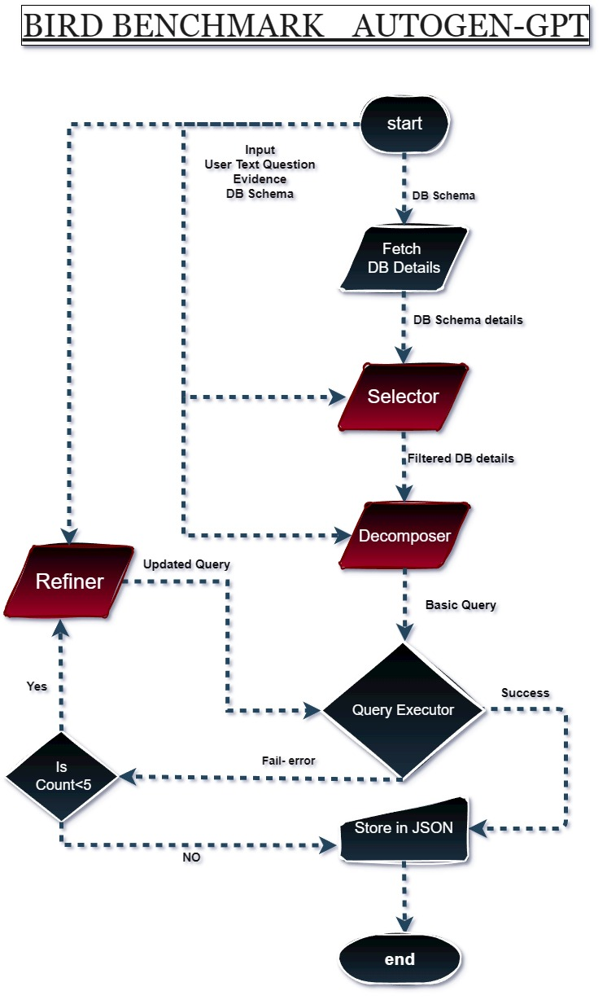

Master_Bot: Natural Language to SQL with LLM-Powered Agent Pipeline

Overview:
Master_Bot is an intelligent Multi-agent-based system that converts natural language questions into SQL queries using OpenAI’s GPT-4 Turbo, and executes them on a given SQLite database. It integrates multiple LLM agents to:

Select relevant tables/columns,

Decompose the question into a SQL query,

Refine the query if an error occurs.

This pipeline is designed to enhance accuracy and reliability of SQL generation, especially useful for text-to-SQL research and evaluation.

How It Works
1. Architecture
The project uses a multi-agent design using Autogen, built on the following steps:

        selector() → Agent 1: Table and Column Selector
        Filters only the relevant tables and columns needed for the user question.
        Uses a prompt (tables_selector.txt) to guide GPT-4.

        decomposer() → Agent 2: Decomposer Bot
        Generates SQL from the natural language question using the schema extracted above.
        Prompt defined in decomposer.txt.

        execute_sql()
        Runs the SQL query on the corresponding SQLite database.
        Returns top 5 results and handles any errors.

        refiner() → Agent 3: Refiner Bot
        If the initial query fails, this agent uses error info and table structure to refine and regenerate the SQL.
        Uses the prompt from refiner.txt.

2. Iteration Loop
Loops over a test dataset (mini_dev_sqlite.json).
Stores SQL predictions into masterbot_predict_mini_dev_gpt_4_sqlite.json.

    Requirements
    Install dependencies:
    pip install -r requirements.txt

Clone the mini_dev Benchmark
git clone https://github.com/bird-bench/mini_dev.git

You can download the mini_dev benchmark data as a ZIP.
Make sure the MINIDEV folder is nested exactly as shown above under:
autogen-birdsql/mini_dev/llm/mini_dev_data/minidev/MINIDEV/

create .env file and ensure .env contains:
OPENAI_API_KEY=your-openai-api-key

Running the Bot
python Master_Bot.py

Output is saved to:
./mini_dev/llm/exp_result/masterbot/masterbot_predict_mini_dev_gpt_4_sqlite.json

Each entry contains:
<SQL query>	----- bird -----	<db_id>

Prompts
tables_selector.txt
Contains instructions for selecting tables and columns based on the question and schema.

decomposer.txt
Converts filtered schema and NLQ into SQL.

refiner.txt
Refines SQL query if original fails, using error message and table content.

Adjust the loop range in Master_Bot.__init__() for batch testing or inference.

Built using: Python, SQLite, OpenAI GPT-4, Pandas, Autogen.